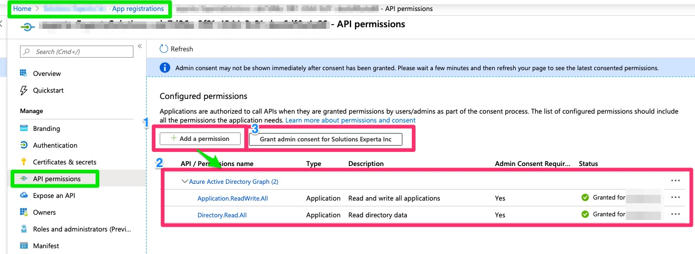
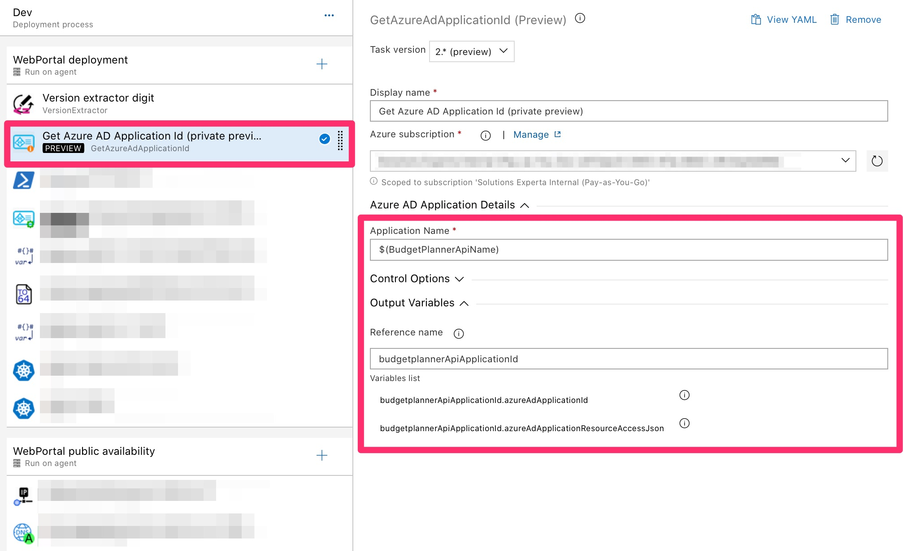
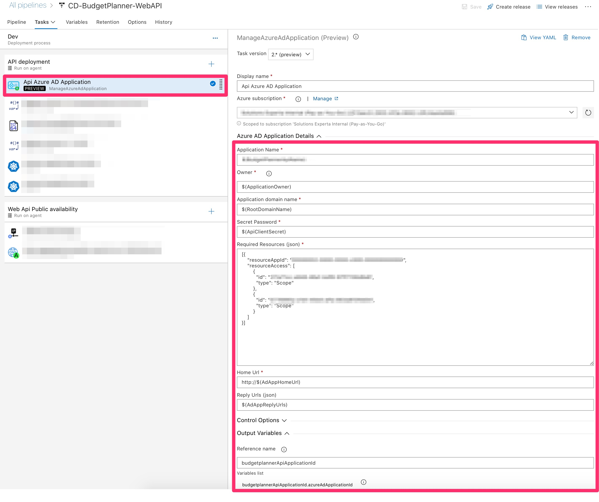
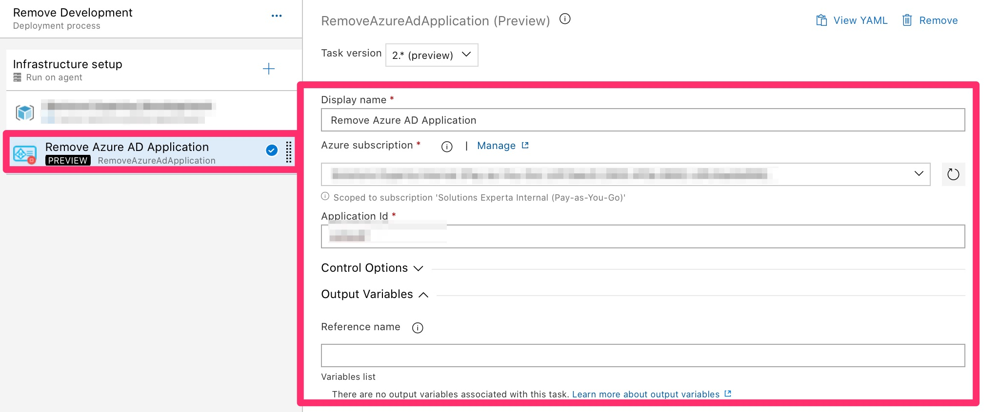

# Purpose


Tasks package that help manage Azure AD Application and Service Principal from Azure DevOps pipeline to your Azure Active Directory.See ***[Release notes](https://github.com/expertasolutions/AzureADApplicationExtensions/releases)***


***This package is all platform compatible.***

# Prerequisites to be used
The **Azure Resource Manager** endpoint used with these tasks in your Azure DevOps require to have the proper **API permissions**.

**1)** On the Azure Portal, you will find the **APP Registrations** option inside the **Azure Active Directory** sections
Select the App registration related to your AzureDevOps **Azure Resource Manager endpoint**.

**2)** Under that App registration, click on the option **API permissions** and add these ***API Permissions***
- Azure Active Directory Graph -> Application.ReadWrite.All
- Azure Active Directory Graph -> Directory.Read.All

**3)** Click on **Grant admin consent for [YOUR Azure AD Organization]** (ensure your are the Owner of the current app registration)



# Tasks include
- GetAzureAdApplicationId
- ManageAzureAdApplication
- RemoveAzureAdApplication

## GetAzureAdApplicationId


## ManageAzureAdApplication

#### Required parameters
- Azure subscription
- Application name
- Owner (user objectId - GUID)
- Application domain name
- Secret password
- Required resources (json)
	```
	 [{
		"resourceAppId": "00000002-0000-0000-c000-000000000000",
		"resourceAccess": [
           {
             "id": "311a71cc-e848-46a1-bdf8-97ff7156d8e6",
             "type": "Scope"
           },
           {
             "id": "5778995a-e1bf-45b8-affa-663a9f3f4d04",
             "type": "Scope"
           }
       ]
     }]
    ```
               
- Home Url
- Reply Urls (json)

	```["http://myurl.com","https://myurl.com]```

## RemoveAzureADApplication

